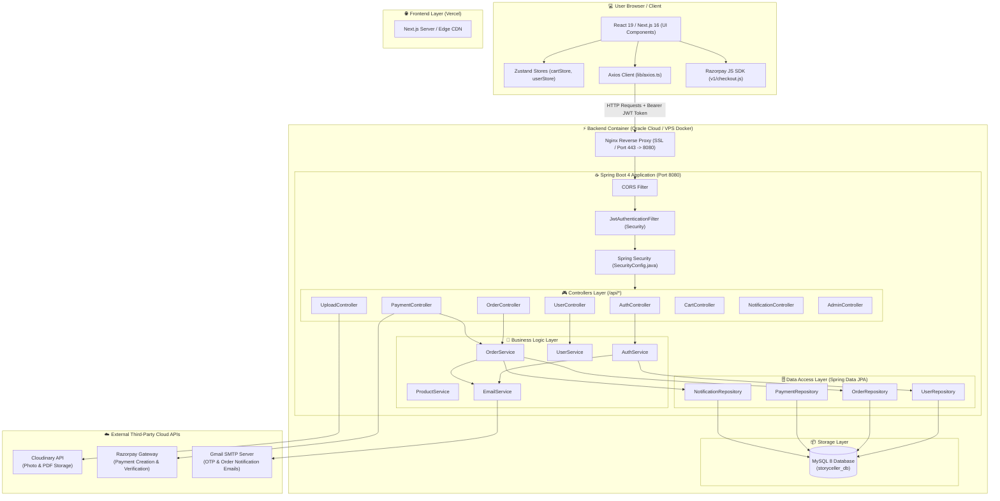
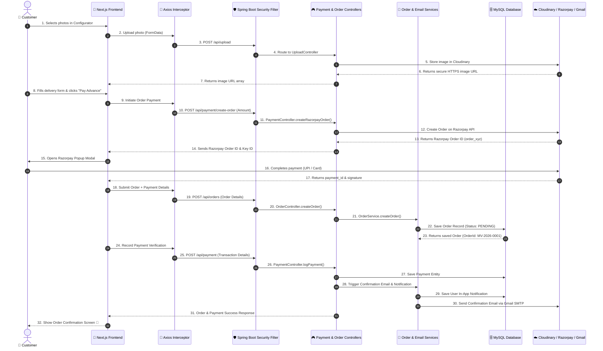
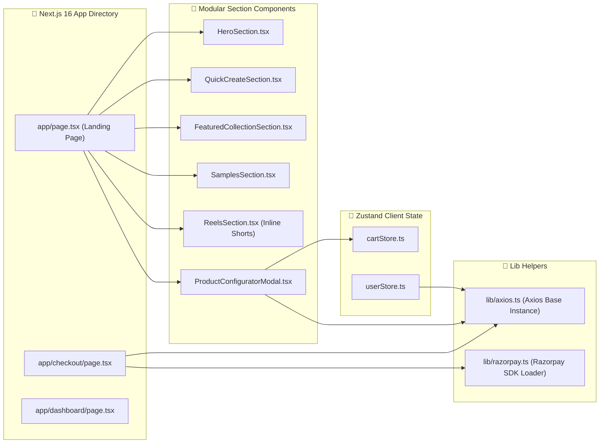
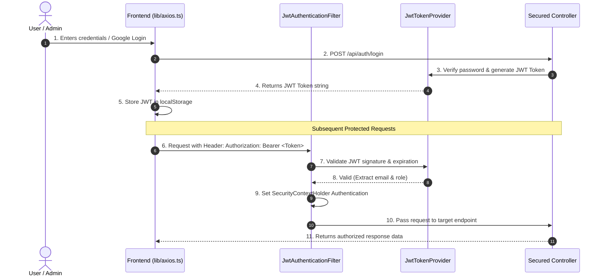

# System Architecture & Complete End-to-End Flow Diagram
## The Story Celler

This document provides a comprehensive technical overview of **The Story Celler** architecture, illustrating how the Next.js 16 Frontend, Spring Boot 4 Backend, MySQL Database, and Cloud Services interact.

---

## 1. High-Level System Architecture



---

## 2. Complete End-to-End User Order & Payment Flow



---

## 3. Spring Boot Backend Package Structure & Component Breakdown

The backend is structured into clean architectural layers following domain-driven best practices:

```
com.thestoryceller.backend
├── 📄 AdminInitializer.java          # Initializes default admin account (admin@storyceller.in) on startup
├── 📄 StorycellerBackendApplication.java # Spring Boot Main Class
│
├── 📂 config/                        # Configuration Beans
│   └── 📄 ApplicationConfig.java     # PasswordEncoder, AuthenticationManager, Beans
│
├── 📂 security/                      # Authentication & JWT Security Layer
│   ├── 📄 SecurityConfig.java        # CORS, Stateless Session, Endpoint Security Rules
│   ├── 📄 JwtAuthenticationFilter.java # Intercepts requests, validates Bearer JWT token
│   ├── 📄 JwtTokenProvider.java      # Generates & verifies JWT signatures
│   └── 📄 CustomUserDetailsService.java # Loads user details by email for Spring Security
│
├── 📂 controller/                    # REST API Endpoints (/api/*)
│   ├── 📄 AuthController.java        # /api/auth/register, /login, /google, /send-otp
│   ├── 📄 OrderController.java       # /api/orders (Create, Get, Track, Status Update)
│   ├── 📄 PaymentController.java     # /api/payment (Create Razorpay Order, Verify Signature)
│   ├── 📄 UploadController.java      # /api/upload (Cloudinary photo & PDF uploader)
│   ├── 📄 UserController.java        # /api/users (Profile view, Password update)
│   ├── 📄 ProductController.java     # /api/products (Product catalog API)
│   ├── 📄 CartController.java        # /api/cart (Cart sync API)
│   ├── 📄 NotificationController.java # /api/notifications (User in-app notifications)
│   ├── 📄 DeliveryController.java     # /api/delivery (Logistics & tracking)
│   ├── 📄 SampleController.java       # /api/samples (Interactive flipbook samples)
│   ├── 📄 WishlistController.java     # /api/wishlist (User wishlist)
│   ├── 📄 ContactController.java      # /api/contact (Contact form submissions)
│   └── 📄 AdminController.java        # /api/admin (Admin dashboard statistics & controls)
│
├── 📂 service/                       # Business Logic Layer
│   ├── 📄 OrderService.java          # Order creation, order ID generation, status updates
│   ├── 📄 EmailService.java          # Gmail SMTP integration (OTP, Order emails, Status updates)
│   ├── 📄 UserService.java           # User profile & registration logic
│   ├── 📄 ProductService.java        # Catalog management
│   ├── 📄 NotificationService.java   # Notification dispatcher
│   └── 📂 impl/                      # Service implementations
│
├── 📂 entity/                        # JPA Database Entities (MySQL Tables)
│   ├── 📄 User.java                  # User credentials, roles, profile info
│   ├── 📄 Order.java                 # Orders, customer details, custom selections, PDF links
│   ├── 📄 Payment.java               # Payment transactions, payment methods, Razorpay IDs
│   ├── 📄 Product.java               # Product catalog items & pricing
│   ├── 📄 Notification.java          # In-app notifications for users
│   ├── 📄 Delivery.java              # Logistics tracking numbers & shipping status
│   ├── 📄 Sample.java                # Flipbook sample catalog items
│   ├── 📄 Cart.java                  # Shopping cart items
│   ├── 📄 Wishlist.java              # Wishlist items
│   └── 📂 enums/                     # Type Definitions
│       ├── 📄 OrderStatus.java       # PENDING, DESIGNING, REVIEW, PRINTING, SHIPPED, DELIVERED
│       └── 📄 Role.java              # ROLE_USER, ROLE_ADMIN
│
└── 📂 repository/                    # Spring Data JPA Repositories
    ├── 📄 UserRepository.java        # findByEmail(), existsByEmail()
    ├── 📄 OrderRepository.java       # findByOrderId(), findByUser()
    ├── 📄 PaymentRepository.java     # findByOrder()
    ├── 📄 NotificationRepository.java# findByUserOrderByCreatedAtDesc()
    └── 📄 DeliveryRepository.java    # findByOrder()
```

---

## 4. Frontend Architecture & File Communication Diagram



---

## 5. Security & Authentication Flow Diagram



---

## 6. Infrastructure & Host Topology (Production vs Development)

| Tier | Component | Environment / Hosting Provider | Technology Used |
| :--- | :--- | :--- | :--- |
| **Frontend** | Next.js 16 Client & Server Components | **Vercel / Cloudflare Pages** | Node.js 20, React 19, TailwindCSS v4, Zustand |
| **Backend Service** | REST API Service | **Oracle Cloud Infrastructure (OCI) Always Free VM** | Java 21, Spring Boot 4, Docker Container |
| **Database** | Relational Database | **Docker Container on Oracle VM** | MySQL 8.0, InnoDB Engine |
| **Storage / CDN** | Photo & PDF Storage | **Cloudinary Cloud API** | Automatic WebP/AVIF transformations |
| **Payments** | Payment Gateway | **Razorpay Gateway** | Razorpay Java SDK + JS Checkout SDK |
| **Email Service** | OTP & Order Emails | **Gmail SMTP / Spring Mail** | Port 587 (TLS), App Passwords |
